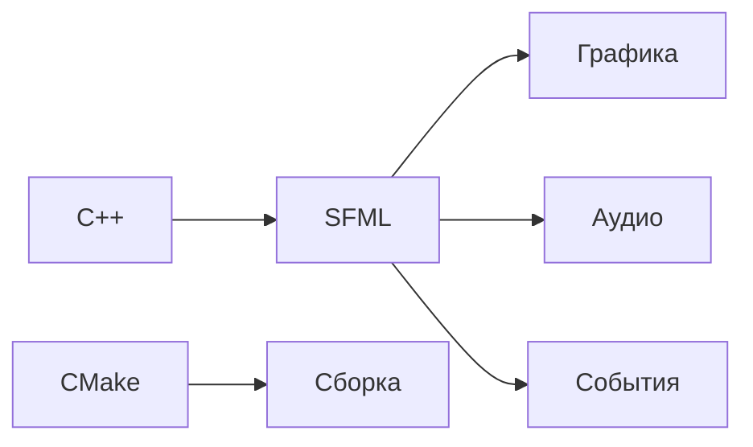

# ---# 🐍 Snake Game

[ссылка на демо](https://www.youtube.com/watch?v=EUxARO1RJ5A)

Классическая игра "Змейка" с современными улучшениями и тремя уникальными режимами. Реализована на C++ с использованием графической библиотеки SFML.

## 🎮 Особенности игры
- **3 режима игры**:
  - `Классический` - стандартные правила
  - `Со стенами` - случайно генерируемые препятствия
  - `Телепорт` - выход за границы экрана телепортирует змейку
- **Система спецэффектов**:
  - 🍎 Обычные фрукты (+10 очков)
  - ⚡ Ускорение (временное увеличение скорости)
  - 🐌 Замедление (временное уменьшение скорости)
  - 📏 Увеличение длины (+2 сегмента)
  - 🔻 Уменьшение длины (-2 сегмента)
  - 🌀 Зеркальное управление (инверсия направления)
- **Прогрессивная сложность**:
  - Система жизней (до 3 в классическом режиме)
  - Динамическая скорость движения
  - Рекордная таблица

## 🛠 Технологический стек


## 📦 Структура проекта

### Ключевые классы
```mermaid
classDiagram
    class SnakeGame {
        -GameState currentState
        -GameMode currentMode
        +run()
        +handleInput()
        +update()
        +render()
    }
    
    class SnakeSegment {
        -sf::Sprite sprite
        +setPosition()
        +draw()
    }
    
    class Fruit {
        -FruitType type
        +getType()
        +draw()
    }
    
    class Wall {
        -sf::RectangleShape shape
        +draw()
        +getBounds()
    }
    
    class Button {
        -sf::RectangleShape shape
        -sf::Text text
        +draw()
        +handleClick()
    }
    
    SnakeGame --> SnakeSegment
    SnakeGame --> Fruit
    SnakeGame --> Wall
    SnakeGame --> Button
   ``` 

## 🛠 Основные функции

### Управление игровым процессом
| Функция                  | Параметры       | Возвращаемое значение | Описание                                                                 |
|--------------------------|-----------------|-----------------------|--------------------------------------------------------------------------|
| `initializeGame()`       | -              | `void`                | Инициализация текстур, шрифтов, UI элементов                            |
| `resetGame()`            | -              | `void`                | Сброс состояния игры к начальным параметрам                             |
| `startGame()`            | `GameMode mode`| `void`                | Запуск игры в выбранном режиме (Classic/Walls/Teleport)                 |
| `endGame()`              | -              | `void`                | Обработка завершения игры, переход к экрану Game Over                   |

### Логика игры
| Функция                  | Параметры       | Возвращаемое значение | Описание                                                                 |
|--------------------------|-----------------|-----------------------|--------------------------------------------------------------------------|
| `moveSnake()`            | -              | `void`                | Основная логика перемещения змейки                                       |
| `spawnFruit()`           | -              | `void`                | Генерация нового фрукта в доступном месте                                |
| `isFruitAccessible()`    | `Vector2i pos` | `bool`                | Проверка доступности позиции для фрукта                                  |
| `applyFruitEffect()`     | `FruitType type`| `void`                | Применение эффектов спецфруктов                                         |
| `loseLife()`             | -              | `void`                | Обработка потери жизни, проверка конца игры                              |

### Коллизии
| Функция                  | Параметры        | Возвращаемое значение | Описание                                                                 |
|--------------------------|------------------|-----------------------|--------------------------------------------------------------------------|
| `handleWallCollision()`  | `Vector2i& pos`  | `void`                | Обработка столкновений со стенами/границами                              |
| `handleSelfCollision()`  | `Vector2i pos`   | `void`                | Проверка столкновения головы змейки с телом                              |
| `handleFruitCollision()` | `Vector2i pos`   | `void`                | Обработка сбора фруктов змейкой                                          |

### Пользовательский интерфейс
| Функция                  | Параметры                | Возвращаемое значение | Описание                                                                 |
|--------------------------|--------------------------|-----------------------|--------------------------------------------------------------------------|
| `setupMainMenu()`        | -                        | `void`                | Инициализация кнопок главного меню                                       |
| `setupGameUI()`          | -                        | `void`                | Настройка игрового UI (очки, режим, таймеры)                             |
| `updateUIText()`         | -                        | `void`                | Обновление текстовых элементов интерфейса                                |
| `renderMainMenu()`       | -                        | `void`                | Отрисовка главного меню                                                  |
| `renderGame()`           | -                        | `void`                | Отрисовка игрового экрана                                                |
| `renderGameOver()`       | -                        | `void`                | Отрисовка экрана завершения игры 


```
📥 Установка и запуск
bash
# Клонирование репозитория
git clone https://github.com/ваш-логин/snake-game.git
cd snake-game

# Сборка проекта
mkdir build && cd build
cmake .. -DSFML_DIR="путь/к/sfml"
make

# Запуск
./SnakeGame
```
🖼 Скриншоты 


 

# ---
